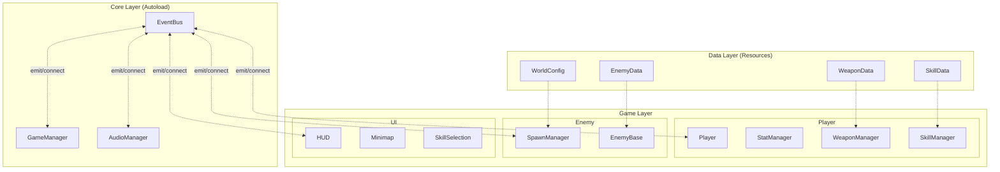
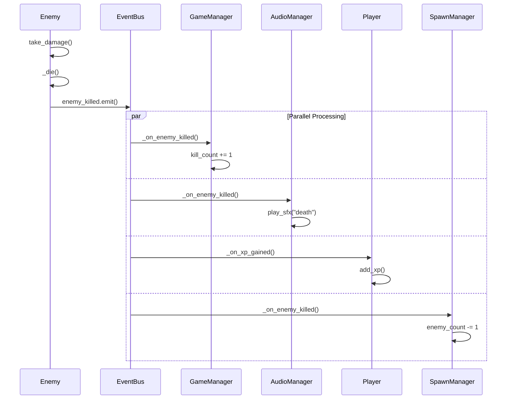
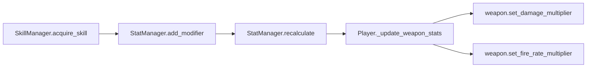
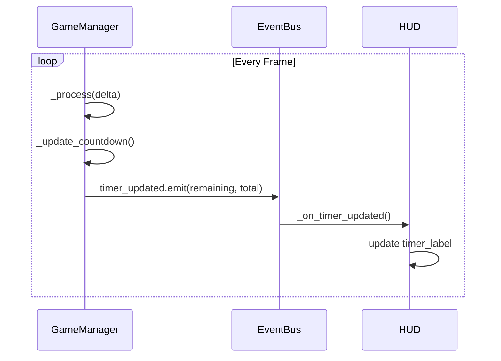

# Architecture Guide

뱀서라이크 게임 프레임워크의 아키텍처 설계 문서입니다.

> **Last Updated**: 2024-12-30

## 목차

1. [설계 철학](#설계-철학)
2. [시스템 아키텍처](#시스템-아키텍처)
3. [데이터 흐름](#데이터-흐름)
4. [핵심 패턴](#핵심-패턴)
5. [씬 구조](#씬-구조)
6. [확장 가이드](#확장-가이드)

---

## 설계 철학

### 1. 느슨한 결합 (Loose Coupling)

시스템 간 직접 참조 대신 **EventBus**를 통한 이벤트 기반 통신:

```
❌ Bad: player.gd에서 hud.update_health() 직접 호출
✅ Good: EventBus.player_damaged.emit() → HUD가 구독하여 반응
```

**장점:**
- 시스템 독립적 테스트 가능
- 새 기능 추가 시 기존 코드 수정 최소화
- 런타임에 구독자 추가/제거 용이

### 2. 데이터 주도 설계 (Data-Driven Design)

게임 데이터를 **Resource**로 분리하여 코드와 데이터 분리:

| Resource | 역할 |
|----------|------|
| `WeaponData` | 무기 스탯, 레벨별 값 |
| `EnemyData` | 적 스탯, 드롭 설정 |
| `SkillData` | 스킬 효과, 타겟 스탯 |
| `WorldConfig` | 월드 생성 파라미터 |

**장점:**
- 코드 수정 없이 밸런싱 가능
- 에디터에서 직관적 편집
- 버전 관리 용이

### 3. 상속보다 조합 (Composition over Inheritance)

기능을 작은 매니저로 분리하여 조합:

```
Player
├── StatManager     # 스탯 계산
├── WeaponManager   # 무기 관리
├── SkillManager    # 스킬 관리
└── XpSystem        # 경험치/레벨
```

**장점:**
- 단일 책임 원칙
- 기능별 독립적 수정
- 재사용성 향상

---

## 시스템 아키텍처

### 전체 구조



### 레이어 책임

| Layer | 책임 | 예시 |
|-------|------|------|
| **Core** | 전역 서비스, 상태 관리 | EventBus, GameManager |
| **Game** | 게임 로직, 엔티티 | Player, Enemy, UI |
| **Data** | 설정, 밸런싱 값 | WeaponData, EnemyData |

---

## 데이터 흐름

### 이벤트 흐름 예시: 적 처치



### 스탯 계산 흐름



### 타이머 이벤트 흐름



---

## 핵심 패턴

### 1. EventBus 패턴

**목적**: 시스템 간 느슨한 결합

```gdscript
# event_bus.gd (Autoload)
signal enemy_killed(enemy: Node2D, position: Vector2, xp_value: int)
signal player_level_up(player: Node2D, new_level: int)
signal timer_updated(remaining: float, total: float)

# 발행자 (enemy_base.gd)
func _die() -> void:
    if event_bus:
        event_bus.enemy_killed.emit(self, global_position, xp_value)

# 구독자 (game_manager.gd)
func _ready() -> void:
    event_bus.enemy_killed.connect(_on_enemy_killed)

func _on_enemy_killed(_enemy, _pos, _xp) -> void:
    kill_count += 1
```

**규칙:**
- 시그널 이름은 과거형 (`killed`, `spawned`, `damaged`)
- 파라미터는 필요한 최소 정보만
- 구독자는 발행자를 알 필요 없음

### 2. Resource 기반 데이터

**목적**: 코드와 데이터 분리

```gdscript
# enemy_data.gd
class_name EnemyData
extends Resource

@export_group("Stats")
@export var max_health: float = 10.0
@export var move_speed: float = 50.0
@export var damage: float = 10.0

@export_group("Health Drop")
@export var health_drop_base_chance: float = 0.05
@export var health_drop_low_hp_chance: float = 0.20
@export var health_drop_low_hp_threshold: float = 0.3

# 사용 (enemy_base.gd)
func _ready() -> void:
    if enemy_data:
        current_health = enemy_data.max_health
```

**장점:**
- 에디터에서 인스펙터로 편집
- `.tres` 파일로 저장 → 버전 관리 용이
- 런타임에 동적 로드 가능

### 3. StatModifier 시스템

**목적**: 스탯 계산의 유연성

```gdscript
# stat_modifier.gd
enum ModifierMode {
    FLAT,      # base + value
    PERCENT,   # base * (1 + value)
    MULTIPLY   # base * value
}

# 예시
var modifiers = [
    StatModifier.new("damage", 5.0, FLAT),      # +5 데미지
    StatModifier.new("damage", 0.2, PERCENT),   # +20% 데미지
    StatModifier.new("fire_rate", 0.9, MULTIPLY) # 쿨다운 10% 감소
]

# 계산 순서: FLAT → PERCENT → MULTIPLY
func calculate(base: float, mods: Array) -> float:
    var flat_sum = 0.0
    var percent_sum = 0.0
    var multiply_product = 1.0

    for mod in mods:
        match mod.mode:
            FLAT: flat_sum += mod.value
            PERCENT: percent_sum += mod.value
            MULTIPLY: multiply_product *= mod.value

    return (base + flat_sum) * (1.0 + percent_sum) * multiply_product
```

### 4. Separation Steering

**목적**: 적끼리 겹침 방지 (물리 충돌 없이)

```gdscript
func _get_separation_velocity() -> Vector2:
    var separation = Vector2.ZERO
    var nearby_count = 0

    for enemy in get_tree().get_nodes_in_group("enemies"):
        if enemy == self:
            continue

        var to_self = global_position - enemy.global_position
        var distance = to_self.length()

        if distance < separation_radius and distance > 0:
            # 거리가 가까울수록 강하게 밀어냄
            separation += to_self.normalized() * (separation_radius - distance) / separation_radius
            nearby_count += 1

    if nearby_count > 0:
        separation = separation.normalized() * separation_force

    return separation
```

**장점:**
- O(n) 복잡도 (물리 엔진보다 가벼움)
- 부드러운 시각적 효과
- 적 수에 따른 스케일링 용이

### 5. Distance Culling

**목적**: 화면 밖 먼 적 자동 정리

```gdscript
func _cull_distant_enemies(count: int) -> int:
    var distant_enemies: Array = []

    for enemy in current_enemies:
        if not is_instance_valid(enemy) or enemy.is_elite:
            continue

        var distance = enemy.global_position.distance_to(player.global_position)
        if distance > cull_distance:
            distant_enemies.append({"enemy": enemy, "distance": distance})

    # 가장 먼 적부터 삭제
    distant_enemies.sort_custom(func(a, b): return a.distance > b.distance)

    var culled = 0
    for i in range(min(count, distant_enemies.size())):
        distant_enemies[i].enemy.queue_free()
        culled += 1

    return culled
```

**규칙:**
- Elite 적은 컬링 제외
- 스폰 직후 즉시 컬링 방지 (거리 체크)
- 컬링된 적도 kill 이벤트 발생

---

## 씬 구조

### EntityLayer 패턴

**문제**: TileMap 색상이 캐릭터/적 스프라이트에 영향

**해결**: CanvasLayer로 렌더링 분리

```
World (Node2D)
├── TileMap                      # 지형 (z_index: 0)
├── EntityLayer (CanvasLayer)    # 엔티티 (렌더링 분리)
│   ├── Player
│   └── SpawnManager
│       └── [spawned enemies]
├── HUD (CanvasLayer)
├── MinimapUI (CanvasLayer)
└── GameOver (CanvasLayer)
```

**EntityLayer 설정:**
```
[node name="EntityLayer" type="CanvasLayer"]
layer = 1
follow_viewport_enabled = true
```

**중요:** `follow_viewport_enabled = true`로 카메라 추적

---

## 확장 가이드

### 새 무기 추가

1. **WeaponData 리소스 생성**
```
resources/weapons/new_weapon.tres
- damage: 15.0
- fire_rate: 0.3
- projectile_scene: res://scenes/projectiles/new_bullet.tscn
```

2. **WeaponPool에 추가**
```gdscript
# player.gd
@export var weapon_pool: Array[WeaponData] = [
    preload("res://resources/weapons/default_pistol.tres"),
    preload("res://resources/weapons/new_weapon.tres"),  # 추가
]
```

### 새 적 타입 추가

1. **EnemyData 리소스 생성**
```
resources/enemies/new_enemy.tres
- max_health: 30.0
- move_speed: 80.0
- damage: 15.0
```

2. **적 씬 생성** (EnemyBase 상속)
```
scenes/enemies/new_enemy.tscn
├── CharacterBody2D (script: extends EnemyBase)
├── CollisionShape2D
└── Sprite2D
```

3. **SpawnManager에 등록**
```gdscript
@export var enemy_pool: Array[EnemyData] = [
    preload("res://resources/enemies/crab_enemy.tres"),
    preload("res://resources/enemies/new_enemy.tres"),  # 추가
]
```

### 새 스킬 추가

1. **SkillData 리소스 생성**
```
resources/skills/new_skill.tres
- skill_name: "New Skill"
- skill_type: PASSIVE
- target_stat: "damage"
- modifier_mode: PERCENT
- level_values: [0.1, 0.2, 0.3, 0.4, 0.5]
```

2. **SkillPool에 추가**
```gdscript
# skill_manager 또는 player
@export var skill_pool: Array[SkillData] = [
    preload("res://resources/skills/move_speed.tres"),
    preload("res://resources/skills/new_skill.tres"),  # 추가
]
```

### 새 이벤트 추가

1. **EventBus에 시그널 추가**
```gdscript
# event_bus.gd
@warning_ignore("unused_signal")
signal new_event(param1: Type, param2: Type)
```

2. **발행자에서 emit**
```gdscript
if event_bus:
    event_bus.new_event.emit(value1, value2)
```

3. **구독자에서 connect**
```gdscript
func _ready() -> void:
    var event_bus = get_node_or_null("/root/EventBus")
    if event_bus:
        event_bus.new_event.connect(_on_new_event)
```

---

## 성능 고려사항

### 적 관리

| 기법 | 목적 | 설정 |
|------|------|------|
| `max_enemies` | 동시 적 수 제한 | 50 (기본) |
| Distance Culling | 먼 적 정리 | 600px 이상 |
| Separation Steering | O(n) 겹침 방지 | 반경 20px |

### 최적화 팁

1. **그룹 활용**: `get_tree().get_nodes_in_group("enemies")`
2. **Physics Process**: 물리 관련만 `_physics_process` 사용
3. **시그널 연결**: `CONNECT_ONE_SHOT` 일회성 연결 활용
4. **Object Pooling**: 발사체 재사용 고려 (향후)

---

## 관련 문서

- [공유 모듈 가이드](shared-modules.md) - API 레퍼런스
- [test-game/TODO.md](../test-game/TODO.md) - 작업 목록
- [test-game/CLAUDE.md](../test-game/CLAUDE.md) - 프로젝트 컨텍스트
